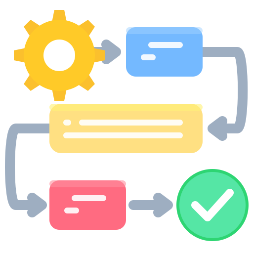
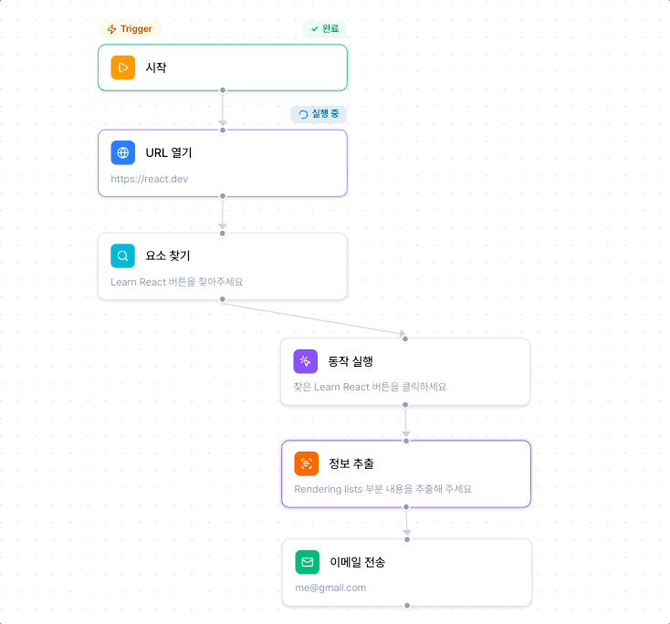
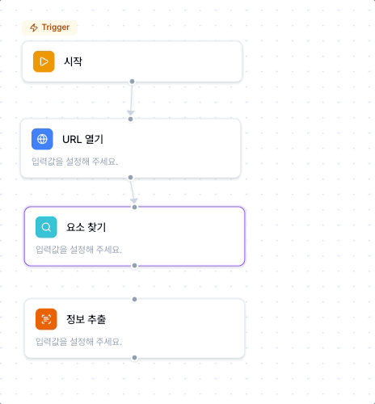
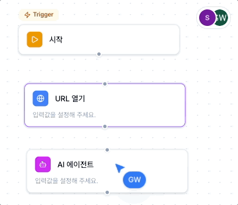
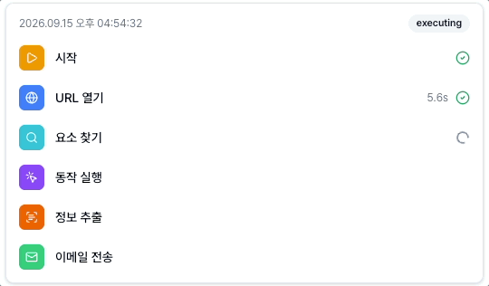
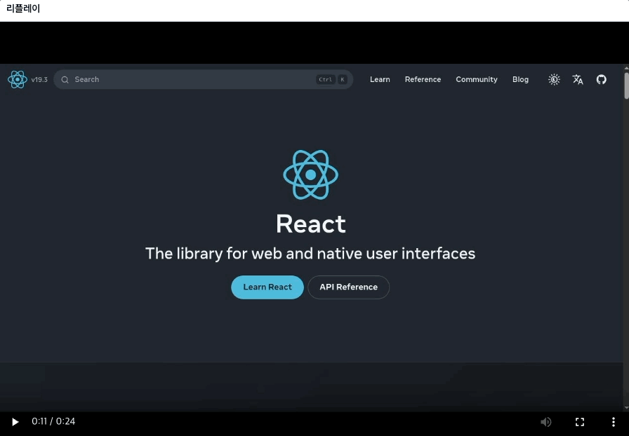

<div align="center">
  
  <h2>Flowtask</h2>
  <p>노드 기반 브라우저 자동화 워크플로우 서비스</p>
</div>

## 프로젝트 소개

Flowtask는 **반복되는 브라우저 작업을 코드 없이 자동화하기 위해 만든 워크플로우 서비스**입니다.

필요한 작업을 노드로 추가하고 실행 순서대로 연결하면, 워크플로우가 백그라운드에서 실제 브라우저를 제어하며 작업을 수행합니다.

여러 사용자가 하나의 워크플로우를 실시간으로 함께 편집할 수 있으며, 실행 과정에서 각 단계의 상태와 입출력, 오류, 실행 시간 및 브라우저 리플레이를 한 화면에서 확인할 수 있습니다.

<div>
  
</div>

## 기술 스택

| 영역               | 기술                                | 주요 사용처                                      |
| ------------------ | ----------------------------------- | ------------------------------------------------ |
| Core               | Next.js 16, React 19, TypeScript    | App Router 기반 애플리케이션 및 서버 로직        |
| UI                 | Tailwind CSS 4, shadcn/ui, CVA      | 스타일링, 디자인 토큰 및 공통 UI 컴포넌트        |
| Workflow           | React Flow                          | 노드·엣지 기반 워크플로우 에디터                 |
| Collaboration      | Liveblocks                          | 워크플로우 실시간 동기화, 커서 및 접속자 표시    |
| Auth & Billing     | Clerk                               | 사용자 인증, 조직 관리 및 Pro 플랜 결제          |
| Background Jobs    | Trigger.dev                         | 워크플로우 백그라운드 실행 및 실행 상태 관리     |
| Browser Automation | Stagehand, Browserbase              | 브라우저 자동화, 세션 관리 및 리플레이           |
| Database           | PostgreSQL, Drizzle ORM             | 워크플로우 및 실행 데이터 저장                   |
| Email              | Resend                              | 실행 결과 이메일 전송                            |
| Monitoring         | Sentry                              | 애플리케이션 및 워크플로우 실행 오류 추적        |
| Testing & Quality  | Vitest, Storybook, ESLint, Prettier | 단위 테스트, UI 문서화, 정적 분석 및 코드 포맷팅 |

## 주요 기능

1. 노드 기반 워크플로우 편집

- URL 열기, 요소 찾기, 동작 실행, 정보 추출, AI 에이전트, 이메일 전송 노드를 조합해 워크플로우를 구성할 수 있습니다.
- 워크플로우 생성 시 실행의 시작점이 되는 시작 노드를 기본으로 제공합니다.
- 노드와 엣지를 선택해 입력값을 수정하거나 연결을 삭제할 수 있습니다.
- 자기 자신으로의 연결, 동일 노드 간 중복 연결, 순환 구조가 만들어지는 연결을 방지합니다.

<div>
  
</div>

2. 단계 간 데이터 연결

- 이전 단계의 실행 결과를 다음 노드의 입력으로 전달할 수 있습니다.
- 에디터에서 이전 노드의 출력을 선택하면 참조 표현식이 입력되고, 워크플로우 실행 시 실제 출력값으로 변환됩니다.
- 중첩된 객체와 배열의 경로를 참조할 수 있으며, 객체와 배열 값은 JSON 문자열로 변환하여 다음 단계에 전달합니다.

3. 백그라운드 워크플로우 실행

- 실행 전 시작 노드, 액션 노드, 연결 상태와 순환 구조를 검증합니다.
- 검증된 그래프를 위상 정렬한 뒤 Trigger.dev 백그라운드 태스크에서 각 노드를 순서대로 실행합니다.
- 브라우저 작업이 필요한 시점에 Stagehand 세션을 생성하고 하나의 워크플로우 실행 안에서 재사용합니다.
- 실행 중인 워크플로우를 중지할 수 있습니다.

4. 실시간 공동 편집

- Clerk 조직을 워크스페이스 단위로 사용합니다.
- 조직별로 독립된 Liveblocks Room을 사용해 워크플로우의 협업 상태를 분리합니다.
- 같은 조직의 사용자가 노드 추가·이동, 입력값 수정, 연결 변경을 실시간으로 공유합니다.
- 현재 접속한 사용자의 커서와 아바타를 표시합니다.

<div>
  
</div>

5. 실행 상태 및 기록

- 현재 실행 중인 단계와 완료 또는 실패한 노드·엣지를 상태에 따라 구분합니다.
- 각 단계의 상태, 입력값, 출력값, 오류 메시지와 실행 시간을 확인할 수 있습니다.
- Trigger.dev 실행 메타데이터를 구독해 워크플로우의 진행 상태를 실시간으로 반영합니다.

<div>
  
</div>

6. 브라우저 세션 리플레이

- Browserbase에 기록된 브라우저 자동화 과정을 실행 콘솔에서 다시 확인할 수 있습니다.
- 리플레이가 준비되면 HLS 플레이리스트를 불러와 실행 과정을 재생합니다.
- 서버에서 로그인 상태, Pro 플랜 및 조직 소유권을 검증한 뒤 리플레이 데이터를 제공합니다.



7. 조직 단위 인증 및 요금제

- Clerk를 통해 로그인, 회원가입, 조직 선택 및 사용자 프로필을 관리합니다.
- 워크플로우와 실행 권한을 현재 선택한 조직을 기준으로 확인합니다.
- Free 플랜에서는 AI 에이전트를 제외한 자동화 노드를 사용할 수 있습니다.
- Pro 플랜에서는 AI 에이전트와 브라우저 세션 리플레이를 추가로 사용할 수 있습니다.
- Pro 결제는 Clerk Billing의 테스트 모드로 구성되어 실제 금액이 청구되지 않습니다.

## 주요 화면

| 경로                   | 설명                                        |
| ---------------------- | ------------------------------------------- |
| `/`                    | 서비스 소개 및 주요 기능                    |
| `/pricing`             | Free, Pro, Ultimate 요금제 비교 및 Pro 결제 |
| `/sign-in`             | 로그인                                      |
| `/sign-up`             | 회원가입                                    |
| `/choose-organization` | 활성 조직 선택 또는 생성                    |
| `/workflows`           | 현재 조직의 워크플로우 목록                 |
| `/workflows/[id]`      | 워크플로우 편집, 실행 기록 및 세션 리플레이 |

## 프로젝트 구조

```text
├── app/
│   ├── (auth)/                  # 로그인, 회원가입, 조직 선택
│   ├── api/                     # 인증, 사용자, 리플레이 API
│   ├── pricing/                 # 가격 페이지
│   └── workflows/               # 워크플로우 페이지
├── components/
│   └── ui/                      # 공통 UI 컴포넌트
├── constants/                   # 공통 상수
├── features/
│   ├── home/                    # 홈 화면 기능
│   ├── pricing/                 # 가격 화면 기능
│   └── workflows/
│       ├── components/          # 에디터 및 실행 UI
│       ├── constants/           # 공통 상수
│       ├── hooks/               # 커스텀 훅
│       ├── libs/                # 그래프 유틸리티
│       ├── nodes/               # 노드 정의 및 실행
│       └── tasks/               # 백그라운드 실행 태스크
├── libs/                        # DB, Clerk, Liveblocks, Browserbase, Resend 설정
├── trigger/                     # Trigger.dev 설정
└── .storybook/                  # Storybook 설정
```

## 로컬 실행

### 요구 사항

- Node.js 24.x
- npm 11.x

### 실행 방법

```bash
npm install
```

`.env.example`을 참고해 `.env.local`에 필요한 환경 변수를 설정한 뒤 데이터베이스를 마이그레이션하고 개발 서버를 실행합니다.

```bash
npm run db:migrate
npm run dev
```

워크플로우 실행 기능을 사용하려면 별도의 터미널에서 Trigger.dev 개발 서버를 실행합니다.

```bash
npm run trigger:dev
```

## 참고 사항

- Clerk Billing은 테스트 모드로 구성되어 실제 결제가 발생하지 않습니다.
- Browserbase 사용량과 리플레이 보존 기간은 관리 중인 Browserbase 요금제 정책을 따릅니다.
